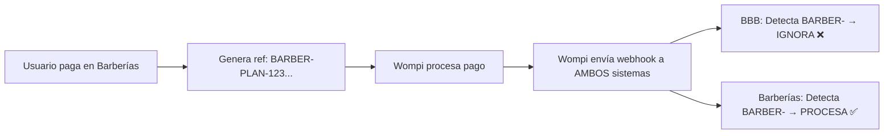
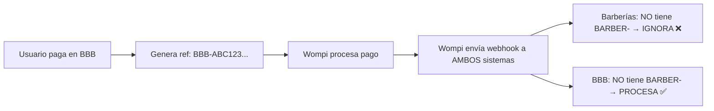

# INTEGRACIÓN MULTI-SISTEMA CON WOMPI

## 📋 Resumen Ejecutivo

Este documento explica cómo **BBB Páginas Web** y **Barberías Vélez** comparten la misma cuenta de Wompi sin conflictos, mediante un sistema de filtrado de referencias de pago.

**Fecha de implementación**: 17 de octubre de 2025  
**Estado**: ✅ IMPLEMENTADO  
**Sistemas involucrados**:
- 🌐 BBB Páginas Web (bbbpaginasweb.com)
- 💈 Barberías Vélez (barberiasvelez.com)

---

## 🎯 Problema Resuelto

### Antes (❌ Problema):
- Ambos sistemas usaban la misma cuenta de Wompi
- Wompi enviaba webhooks a AMBOS sistemas para TODOS los pagos
- Cada sistema intentaba procesar pagos del otro sistema
- Resultado: Errores, duplicaciones, pagos mal asignados

### Después (✅ Solución):
- Cada sistema tiene un **prefijo único** en sus referencias de pago
- Cada sistema **filtra** webhooks que no le pertenecen
- Procesamiento limpio y sin conflictos

---

## 🔧 Solución Implementada

### 1️⃣ Sistema de Barberías Vélez (barberiasvelez.com)

**Prefijo de referencia**: `BARBER-`

Ejemplos de referencias generadas:
```
BARBER-PLAN-123-1697567890-abc123
BARBER-CITA-456-1697567891-def456
```

**Lógica del webhook** (`WebhookController.php`):
```php
// Si NO empieza con BARBER-, IGNORAR
if (!str_starts_with($reference, 'BARBER-')) {
    Log::info('Webhook NO pertenece a Barberías - IGNORANDO');
    return;
}

// Si llegamos aquí, es un pago de Barberías - PROCESAR
```

### 2️⃣ Sistema BBB Páginas Web (bbbpaginasweb.com)

**Prefijo de referencia**: `BBB-` (tu formato actual)

Ejemplos de referencias generadas:
```
BBB-ABC123-1697567890
BBB-USER789-1697567891-xyz
```

**Lógica del webhook** (`WompiController.php`):
```php
// Si empieza con BARBER-, es del otro sistema - IGNORAR
if (str_starts_with($reference, 'BARBER-')) {
    Log::info('Webhook pertenece a Barberías Vélez - IGNORANDO');
    return;
}

// Si llegamos aquí, es un pago de BBB - PROCESAR
```

---

## 📊 Flujo de Procesamiento

### Escenario 1: Pago en Barberías Vélez



### Escenario 2: Pago en BBB Páginas Web



---

## ✅ Cambios Realizados en BBB Páginas Web

### Archivo modificado:
```
app/Http/Controllers/Api/WompiController.php
```

### Código añadido (líneas ~170-184):
```php
// ========== FILTRO PARA SISTEMA DE BARBERÍAS ==========
// Si la referencia empieza con BARBER-, pertenece al sistema de Barberías Vélez
// Este sistema (BBB Páginas Web) NO debe procesar esos pagos
if ($reference && str_starts_with($reference, 'BARBER-')) {
    Log::info('Webhook pertenece al sistema de Barberías Vélez - IGNORANDO', [
        'reference' => $reference,
        'transaction_id' => $transactionId,
        'system' => 'barberiasvelez.com',
        'current_system' => 'bbbpaginasweb.com'
    ]);
    
    // No procesar este webhook en el sistema BBB
    return;
}

// Si llegamos aquí, es un pago del sistema BBB Páginas Web
Log::info('Webhook pertenece al sistema BBB Páginas Web - PROCESANDO', [
    'reference' => $reference,
    'transaction_id' => $transactionId
]);
// ========== FIN FILTRO ==========
```

---

## 🧪 Testing

### Cómo probar en desarrollo:

1. **Simular webhook de Barberías**:
```bash
curl -X POST http://localhost:8000/api/webhooks/wompi \
  -H "Content-Type: application/json" \
  -d '{
    "event": "transaction.updated",
    "data": {
      "transaction": {
        "id": "test-123",
        "reference": "BARBER-PLAN-456-1697567890-abc",
        "status": "APPROVED",
        "amount_in_cents": 5000000
      }
    }
  }'
```

**Resultado esperado**: Log dice "IGNORANDO", no se procesa.

2. **Simular webhook de BBB**:
```bash
curl -X POST http://localhost:8000/api/webhooks/wompi \
  -H "Content-Type: application/json" \
  -d '{
    "event": "transaction.updated",
    "data": {
      "transaction": {
        "id": "test-456",
        "reference": "BBB-ABC123-1697567890",
        "status": "APPROVED",
        "amount_in_cents": 5000000
      }
    }
  }'
```

**Resultado esperado**: Log dice "PROCESANDO", se actualiza la renovación.

### Cómo probar en producción:

1. Revisar logs en tiempo real:
```bash
tail -f storage/logs/laravel.log | grep "WOMPI\|Webhook"
```

2. Realizar pago de prueba en Barberías Vélez

3. Verificar en logs de BBB:
```
[YYYY-MM-DD HH:MM:SS] production.INFO: Webhook pertenece al sistema de Barberías Vélez - IGNORANDO
```

4. Verificar que NO se creó ninguna renovación en BBB

---

## 📝 Logs a Monitorear

### Logs en BBB Páginas Web (`storage/logs/laravel.log`):

**Webhook de Barberías (debe ignorarse)**:
```
[INFO] Transaction data parsed {"reference":"BARBER-PLAN-123..."}
[INFO] Webhook pertenece al sistema de Barberías Vélez - IGNORANDO
```

**Webhook de BBB (debe procesarse)**:
```
[INFO] Transaction data parsed {"reference":"BBB-ABC123..."}
[INFO] Webhook pertenece al sistema BBB Páginas Web - PROCESANDO
[INFO] Wompi: Renovation already completed. Skipping.
```

---

## 🔐 Seguridad

### Validaciones implementadas:

1. ✅ **Firma de Wompi**: Ambos sistemas validan `X-Event-Signature`
2. ✅ **Checksum de integridad**: Validación del body con `integrity_key`
3. ✅ **Idempotencia**: No se procesan pagos duplicados
4. ✅ **Filtrado por prefijo**: Cada sistema solo procesa sus pagos
5. ✅ **Logging completo**: Trazabilidad total de cada webhook

### Configuración requerida en `.env`:

```env
WOMPI_PUBLIC_KEY=pub_prod_xxxxx
WOMPI_PRIVATE_KEY=prv_prod_xxxxx
WOMPI_EVENTS_KEY=prod_events_xxxxx
WOMPI_INTEGRITY_KEY=prod_integrity_xxxxx
```

---

## ⚠️ Consideraciones Importantes

### 1. Prefijos NO deben cambiar
- `BARBER-` → Sistema de Barberías (fijo)
- `BBB-` → Sistema BBB Páginas Web (verificar consistencia)

### 2. Wompi envía webhook a AMBAS URLs
Panel de Wompi debe tener configuradas:
- `https://barberiasvelez.com/api/webhooks/wompi`
- `https://bbbpaginasweb.com/api/webhooks/wompi`

### 3. NO es necesario "reenviar" webhooks
- Solución anterior (en el prompt): Reenviar webhook de BBB → Barberías ❌
- Solución actual: Cada sistema filtra directamente ✅

### 4. Ventajas de esta arquitectura:
- ✅ Más simple y eficiente
- ✅ Menos puntos de fallo
- ✅ No requiere HTTP requests adicionales
- ✅ Logs más limpios
- ✅ Mejor performance

---

## 🚀 Deploy

### Pasos para aplicar en producción:

1. **Verificar cambios localmente**:
```bash
php artisan cache:clear
php artisan config:clear
php artisan route:clear
php artisan view:clear
```

2. **Ejecutar deploy**:
```bash
./deploy.sh
```

3. **Verificar en servidor**:
```bash
ssh -p 65002 u675855880@46.202.183.32
cd /home/u675855880/domains/bbbpaginasweb.com/back
tail -f storage/logs/laravel.log
```

4. **Monitorear webhooks**:
   - Esperar próximo pago en cualquier sistema
   - Verificar logs muestran comportamiento correcto

---

## 📞 Soporte

### Si algo falla:

1. **Revisar logs** en ambos sistemas
2. **Verificar configuración de Wompi**:
   - Panel: https://comercios.wompi.co/
   - Webhooks configurados correctamente
3. **Contactar equipo de desarrollo**

### Errores comunes:

| Error | Causa | Solución |
|-------|-------|----------|
| Webhook no llega | URL mal configurada en Wompi | Verificar panel de Wompi |
| Se procesan pagos de Barberías | Filtro no aplicado | Verificar código del WompiController |
| Firma inválida | Keys incorrectas en `.env` | Verificar variables de entorno |

---

## 📚 Referencias

- **Documentación Wompi**: https://docs.wompi.co/
- **Repositorio BBB**: https://github.com/nelsondeveloper2022/bbbpaginasweb
- **Sistema de Barberías**: barberiasvelez.com

---

## 📅 Historial de Cambios

| Fecha | Versión | Cambios |
|-------|---------|---------|
| 2025-10-17 | 1.0 | Implementación inicial del filtro de webhooks |

---

**Mantenido por**: Equipo de Desarrollo BBB + Barberías Vélez  
**Última actualización**: 17 de octubre de 2025
